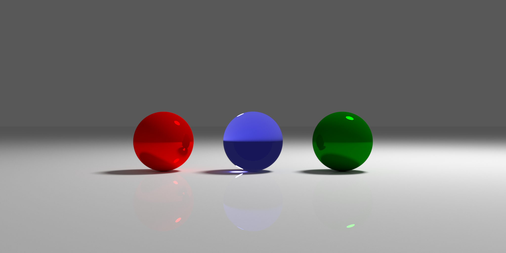
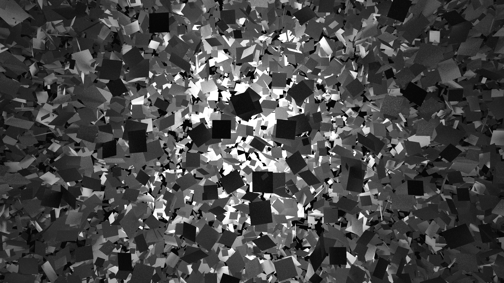
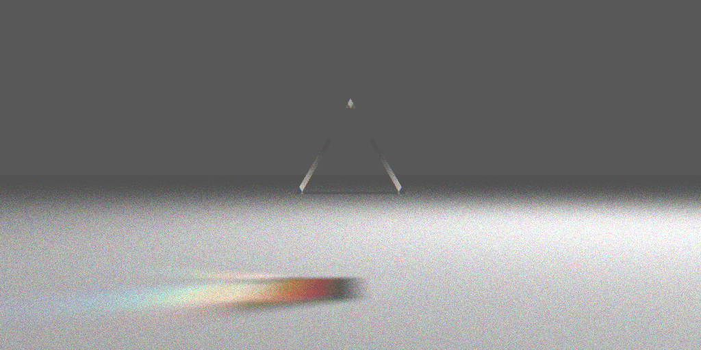
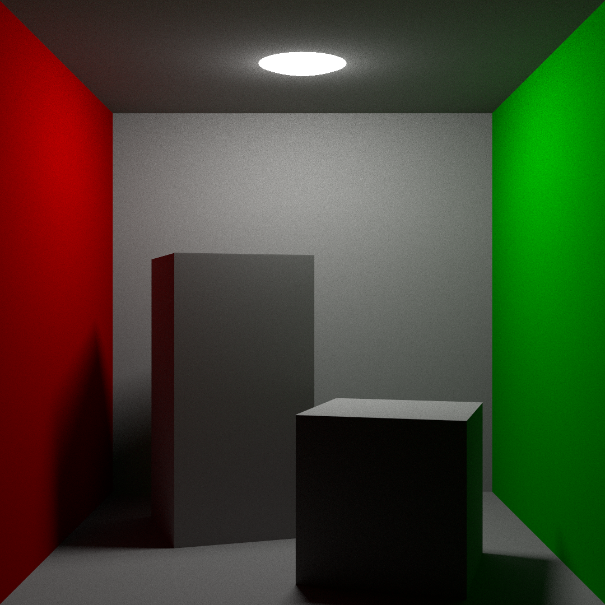

# tracer

A CPU/GPU raytracer, implemented in Rust.

# Examples

# Features

## Core raytracing algorithm

Raytracing is implemented with a recursive function with the following steps:
* find the next ray/object intersection
* add the contributions directly from the object
* optionally sample a light ray and add its contribution (this speeds up convergence while still staying unbiased)
* sample a new ray from the object, and recursively call the function to calculate its contribution
* combine all contributions, accounting for absorption in the medium

All ray sampling uses [Importance Sampling](https://en.wikipedia.org/wiki/Importance_sampling) to speed up convergence.

## Supported features
* Camera model: depth of field, fov, antialiasing
* Shapes: spheres, planes, triangles, squares, cylinders
* Objects can be scaled, transformed and rotated by a full 4x4 matrix.
* Materials: diffuse, spectral, emissive, transparent
* Mediums: index of refraction, color-specific absorption

## Performance
* Multithreaded, tile-based to improve memory locality
* Ray-object intersection tests can use an acceleration structure, either a [Bounding Volume Hierarchy](https://en.wikipedia.org/wiki/Bounding_volume_hierarchy) or an [Octree](https://en.wikipedia.org/wiki/Octree).
* The `gpu` branch has an OpenCL-based GPU implementation using `glsl` kernels, but not all features of the CPU-based renderer are implemented yet.

## IO
* Scenes can be constructed in code, see [scenes.rs](./src/scenes.rs) for examples.
* Loading `.obj` files as a set of triangles is also supported.
* Output files are `.png` or `.exr` (for HDR images).
* Optionally rendering progress can be seen by progressively rendering to the [tev](https://github.com/Tom94/tev) image viewer using the [tev_client](https://crates.io/crates/tev_client) crate.

# Interesting resources:
* [Physically Based Rendering: From Theory To Implementation](http://www.pbr-book.org/) (book)
* [Raytracing in One Weekend](https://raytracing.github.io/) (tutorial series)
* [How to build a BVH](https://jacco.ompf2.com/2022/04/13/how-to-build-a-bvh-part-1-basics/) (blog series)

* [Thinking Parallel](https://developer.nvidia.com/blog/thinking-parallel-part-i-collision-detection-gpu/) (blog series)
